# Train A Neural Network On Bird Database For Image Classification

## Introduction
I obtained the image database from HuggingFace [https://huggingface.co/datasets/yashikota/birds-525-species-image-classification](https://huggingface.co/datasets/yashikota/birds-525-species-image-classification) and set out to create a model that classifies the images in this dataset.  
The dataset consists of:

- **Train images:** 84,635
- **Test images:** 2,625
- **Validation images:** 2,625
- **Image size:** 224 × 224
- **Classes:** 525 (+1 class for images without birds)

*Examples from the database:*  
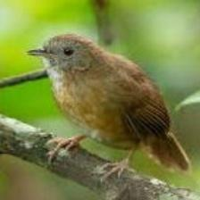
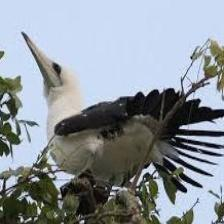
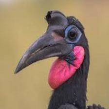

## What's in this project?
1. This project documents the workflow I followed to obtain the best model possible, detailing my attempts, failures, and successes. At the end, the best model is presented to demonstrate its performance.  

2. For each model, there is a log file alongside the model that records its performance and the scores for each training epoch. Additionally, a script converts these logs into an SVG image for easier visualization.

3. A database viewer is included that can be configured to display training, test, or validation images with or without applied image transforms.

4. Testing scripts are provided; *note*: not all code is tested, as this project focuses more on AI development than on software engineering practices.

> [!NOTE]
> Only the core points of the research are retained here; not every model architecture or training run is shown.

## Before training
* I built a database-viewer application to inspect the database.
* I created a class that loads the database and converts it to NumPy format. (see the original source at: [https://huggingface.co/datasets/yashikota/birds-525-species-image-classification](https://huggingface.co/datasets/yashikota/birds-525-species-image-classification); the database itself is listed in `.gitignore`).
* I implemented a cache that stores images as pre‑converted PyTorch tensors, enabling fast access during training.

 

# Model Training

## CNN-1
This model is a simple CNN with a small, **114K** parameters.  
**Input size:** 94x94  

After several experiments, the best results I obtained were:
- Loss:
    - train-loss: 2.098122
    - test-loss:  1.869292
    - val-loss:   2.13719
- Accuracy:
    - train-accuracy: 53.301830%
    - test-accuracy:  57.485710%
    - val-accuracy:   53.676189%

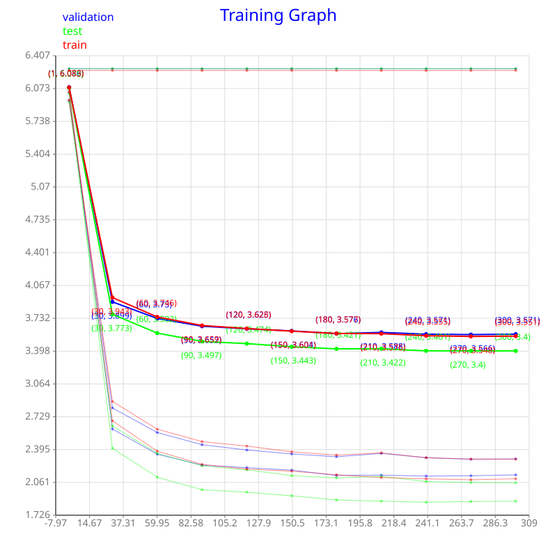

> [!TIP]
> The model is too small to learn complex patterns.

## CNN-2
This model is also a simple CNN, slightly larger with **137K** parameters.  
**Input size:** 224x224  
Best results:
- Loss:
    - train-loss: 1.790865
    - test-loss:  1.669988
    - val-loss:   1.951408
- Accuracy:
    - train-accuracy: 60.057896%
    - test-accuracy:  62.019043%
    - val-accuracy:   57.333332%

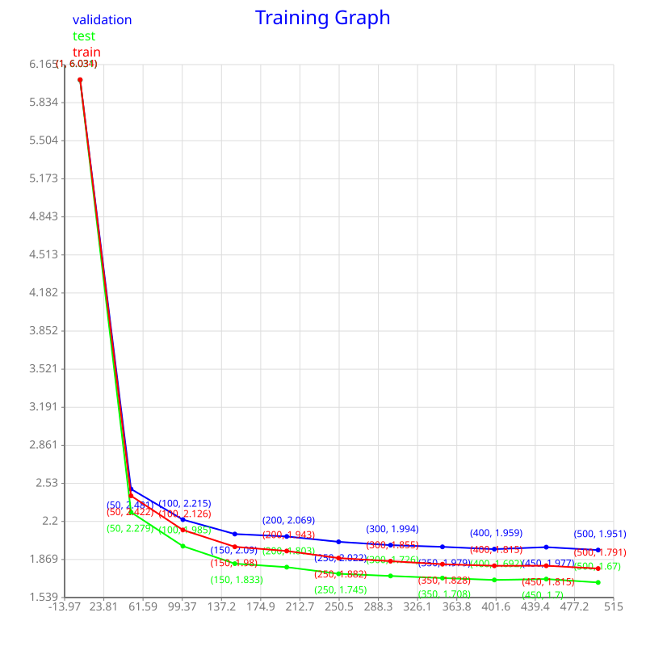

> [!NOTE]
> Although this model performs better than CNN‑1, it is still too small to capture complex patterns.

> [!IMPORTANT]
> The increase in input size (from 94x94 to 224x224) likely accounts for the improvement.

## AlexNet-like-1
This model follows the AlexNet architecture with **12M** parameters, modifying the final linear layers from 4096 to 1024 units.  
Input size: 224x224  
Best results:
- Loss:
    - train-loss: 0.473686
    - test-loss:  0.98839
    - val-loss:   1.289062
- Accuracy:
    - train-accuracy: 89.238495%
    - test-accuracy:  75.580956%
    - val_accuracy:   70.247620%

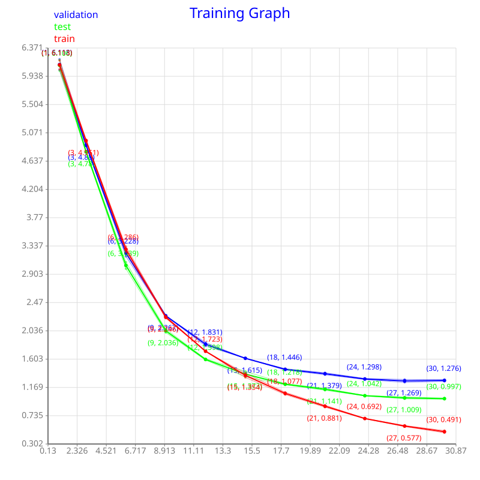

> [!WARNING]
> These results come from epoch 30; training longer leads to over‑fitting on the training data.

## AlexNet-like-2
This AlexNet variant has **10M** parameters, with the same linear‑layer change (4096 -> 1024) and a reduced channel count in the convolutional layers.  
Input size: 224x224  
Best results:
- Loss:
    - train-loss: 0.094126
    - test-loss:  0.823275
    - val-loss:   1.129378
- Accuracy:
    - train-accuracy: 98.961426%
    - test-accuracy:  79.695236%
    - val-accuracy:   75.733337%

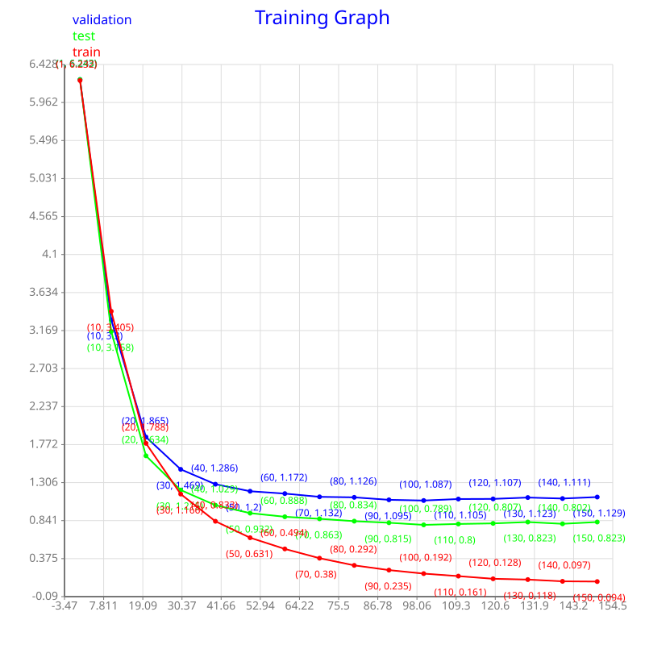

> [!NOTE]
> More room for training, but over-fitting remains an issue.

## AlexNet-like-3
This model is a further reduced AlexNet with **3M** parameters, changing the final linear layers to 512 units and strongly reducing convolutional channels.  
Input size: 224x224  
Best results:

- Loss:
    - train-loss: 0.124912
    - test-loss:  1.20639
    - val-loss:   1.682443
- Accuracy:
    - train-accuracy: 98.092995%
    - test-accuracy:  72.114281%
    - val_accuracy:   68.380951%

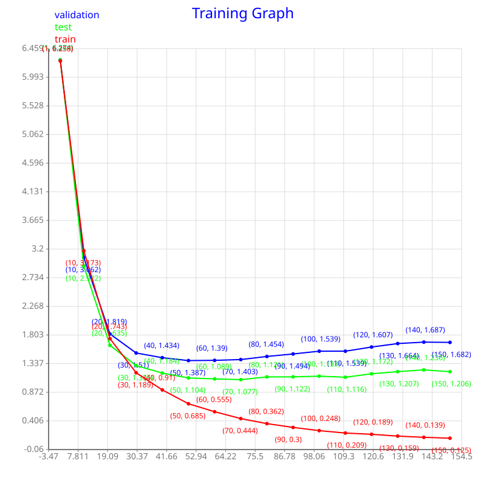

> [!IMPORTANT]
> As the model shrinks, it struggles more on test and validation images. Simply making the AlexNet‑like model smaller does not solve the over‑fitting problem; a different approach is needed.  

---

At this point I suspected that the classic AlexNet architecture might be outdated for this task, so I experimented with hybrids that blend AlexNet and VGG ideas (using stacked 3x3 convolutions instead of larger kernels). The resulting **CNN‑3** (7M parameters) did not surpass the AlexNet variants, so I abandoned that direction.  

Another attempt, **AlexNet‑like‑4** (7M parameters), likewise failed to deliver the desired performance.

---

 

# Image Transforms - Adding Data Variance

I trained many models with varying sizes, learning rates, batch sizes, and epoch counts. The outcomes fell into two categories:

* **Small models** - unable to capture complex patterns, yielding poor accuracy on all sets.
* **Large models** - over‑fit to the training set, resulting in low test/validation scores.

To address this, I increased the variance of the training data using `torchvision.transforms.v2`, each image is randomly altered by:
* Random crop (retaining at least 80% of the original image).
* Erasing 0‑2 boxes (each box covers 1%-5% of the image area).
* Horizontal flip.
* Color jitter.

*Examples from the database, after transformation:*  
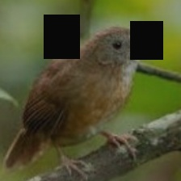
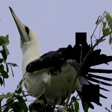
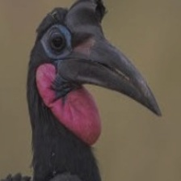

## Train the old networks again
I trained the previously examined architectures with the new altered images to see how they would behave.

### AlexNet-like-3
Best results with augmentations:
- Loss:
    - train-loss: 0.916084
    - test-loss:  0.816708
    - val-loss:   1.064557
- Accuracy:
    - train-accuracy: 78.806648%
    - test-accuracy:  79.847618%
    - val-accuracy:   76.761902%

> [!NOTE]
> The gap between training and validation/test scores has narrowed.

> [!TIP]
> However, the model remains too small to learn sufficiently complex patterns.

*I also trained the **AlexNet-like‑4** and **AlexNet-like‑1** with, but neither yielded satisfactory results (their logs are not present in the repository).*

## AlexNet-like-5
Seeing that the earlier models were too small for the enriched training set, I scaled up the network to **17M** parameters, adjusting the final linear layer from 4096 -> 1536 units.  
Input size: 224x224  
Results:  
- Loss:
    - train-loss: 0.070933
    - test-loss:  0.439326
    - val-loss:   0.791034
- Accuracy:
    - train-accuracy: 98.908257%
    - test-accuracy:  88.761902%
    - val-accuracy:   85.028572%

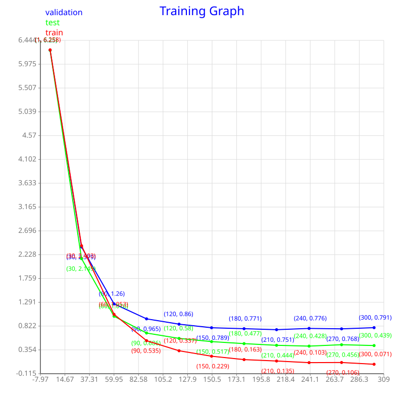

---

Encouraged by the improvement, I tried an even larger variant, **AlexNet‑like‑6** (22M parameters), but observed no further gain.  

Given that AlexNet‑like‑5 already provides strong generalization, I decided to stop the search after AlexNet like architecture here.

---

## VGGNet-16-like
After hearing a recommendation to try a VGG‑style network, I constructed the **VGGNet-16-like** a model with roughly **18M** parameters. Modifications include:
* Changing the final linear layer from 4096 → 1536 units.
* Significantly reducing the number of channels in the convolutional layers.
* Removing padding from the last two convolutional layers.
Input size: 224x224  

**Results will be added soon!**
